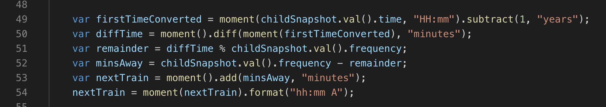

# train-schedule
I built an app based on a train scheulde that takes in an input and displays the input in a table. The table incorporates moment.js by updating the time and minutes away the inputted train is. The data inputted is saved in a Firebase database. 

## Live Link
https://shelbyreins.github.io/train-schedule/

## Description on how to use:

- Open the webpage look at the scheduled trains
- Add a new train:
    - Add a train name
    - Add the destination
    - Add the time of the first train in military time HHmm
    - Add in the frequency
    - Submit 
- The trains arrivial time and minutes away is updated using real time

    

### Game Design Notes

- Be able to submit a train name, destination, first train arrival in military time and frequency in minutes.
- Code this app to calculate when the next train will arrive; this should be relative to the current time.
- Users from other machines are able to see all inputs.

## Technologies Used

- HTML
- CSS
- Git
- Github
- JavaScript
- jQuery
- moment.js
- firebase

    ### Code Snippet
  
    This code snippet illistrates moment.js.

    